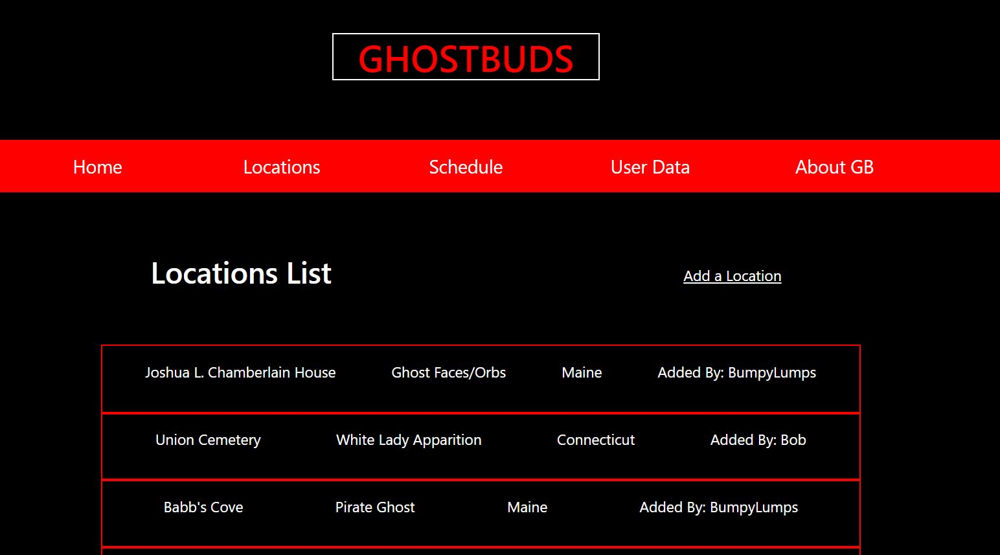

# **GhostBuds** 
A private platform for organizing paranormal investigations

**Link to project:** https://ghostbuds.cyclic.app/

## How It's Made:

**Tech used:** HTML, CSS, Bootstrap, JavaScript, Express, MongoDB, Mongoose, Passport, EJS, [Cloudinary](https://cloudinary.com/)

I built this app to help budding paranormal investigators organize investigations and store their evidence. It utilizes a host of technologies to 
keep that evidence secure with user authentication, and also hosts a list of locations for people to explore. It also allows users to add their own locations, 
and follows MVC organization. Most of the code is backend and utilizes Passport for authentication, [Cloudinary](https://cloudinary.com/) to store images, and MongoDB/Mongoose to store User info, locations, and evidence notes. I also set up base styles with Bootstrap, and customized what I needed in order to maintain my own style/theme. For now, the locations list is public in order to help people who are interested in investigating the paranormal find places to 
start with. 

**This app allows users to :
* Store a database of locations across the USA for paranormal investigations

* Allow users to schedule investigations and pick a location for them

* Allow users to add their own locations

* Allow users to privately store evidence data

## Optimizations

My next updates are going to be focused on adding audio submission to users who have EVP evidence, and introducing User Teams in order to let Users get together 
and schedule investigations with eachother/ share evidence with eachother. I would also like to integrate the Google Maps API so users don't have to leave the site 
to get the location on a map. Finally, I want to add an option to keep locations private to teams, so that anyone who doesn't want to share their location isn't forced 
to on the app. I am also working on making it more mobile friendly. The site itself is responsive, but I would like to implement some small layout tweaks as it looks pretty cramped on mobile at the moment.

## Lessons Learned:

I learned a ton about MVC organization, adding file uploads, and integrating forms during development! I also learned about user authentication, and got to flex my 
EJS knowledge in my views. It was also a great exercise in site organization, as I had to experiment with alot of the routes and controllers to get exactly what I wanted out of app functionality. All in all this has been the largest and most complicated project I've built so far, and am proud of what I've been able to do with 
it!

## Examples:
Here's a few links to check out: 

**[Specific Location](https://ghostbuds.herokuapp.com/locations/specificLocation/63420b72860313080c7f474e)** 

**[About Page](https://ghostbuds.herokuapp.com/about)** 

